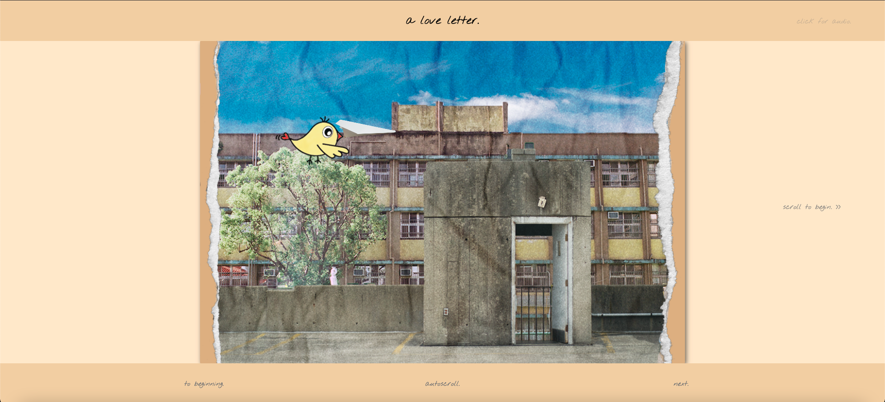
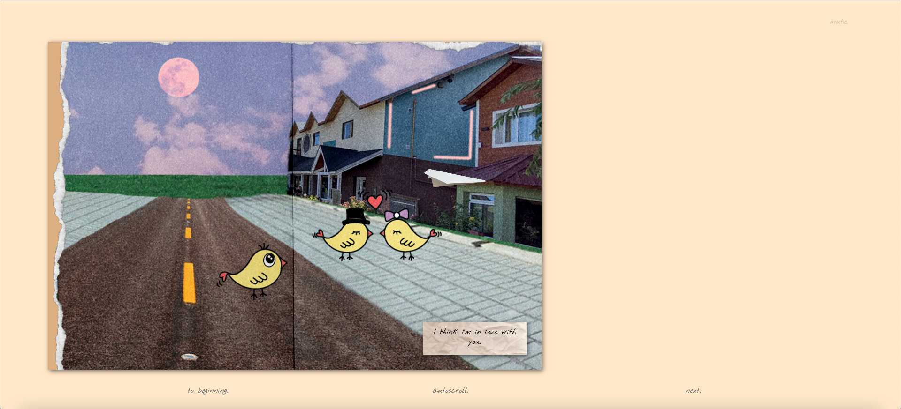
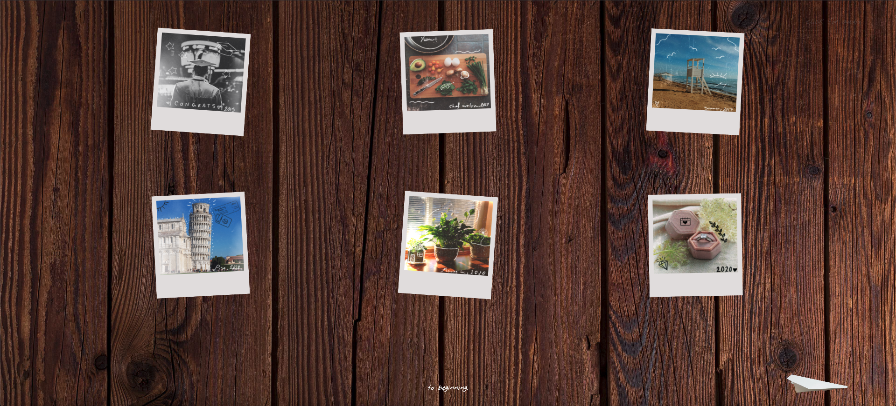

## Assignment 2: a love letter.

### The Concept

Aight, so we're back, ladies and gentlemen, with another round of Nightmares in Horizontal Scrolling with Joseph! Well, actually it wasn't a *nightmare* nightmare this time, just a few problems (major ones, too) here and there. In any case, let's talk about the concept of this interactive comic before getting into details on coding the site.

So, our group was talking about ideas for an interactive comic. There were a lot of ideas passed around, about creating music as an interweaving theme between different panels or maybe using colors to set a mood. However, with none of us being experts in music, this seemed like a bit of a reach (in fact, just the idea of having to draw a comic was kinda outside of our areas of expertise, but no matter). Then we started thinking back to the introduction class and all of the different websites we saw. There was one that had to do with paper airplanes, and then we had an idea: what if we used a plane, flying horizontally, as a constant in the website? Though being the one who suggested the idea, I knew the horrors that awaited creating a horizontal website as I had done it for the first assignment. But it didn't seem like a bad idea (to me at the time) because I thought that I could do it. It's like when you go through something that's absolutely horrendous and then when you come out of it, you go "*oh, that wasn't so bad. Maybe I'll try it again.*" Going off of the theme of having a constant in a scrolling website (I knew how to do this, since I had created the fixed navigation buttons for the first assignment), we started to think of different things that could make a story. A paper airplane, going *where*? Who threw it? To whom? The first idea was that some random person picks it up and throws it again so we would have a bunch of people passing it along, but where did we have the skills do draw such things? It also seemed like it would be an absolute nightmare coding. So we decided, we need one sender and one receiver.

Then came the idea: what if they were the same person? So we had this long talk about how it could be that the person who threw it picks it up years later. This seemed like a really good idea (wait, why didn't we do this?), but then there was the question of why a paper airplane would be there in the first place (ah, I remember now). Regardless, we wanted to somehow incorporate the idea of *time*–– that the space traveled would be the same as time flowing. This was in response to Understanding Comics, where I remembered this bit where McCloud mentioned how comics were limited in width so using longer gutters was not as desirable in representing that time is flowing (or that time has passed). However, with a horizontal website, you're not restricted by page width as it's quite literally the only thing you have. This was a a great way to utilize the (unlimited) horizontal space available to us.

And that's when it hit me that the paper airplane could be a *letter*. Hear me out. I know it's very uncommon, but then again, people fold letters into all kinds of things. Why not a paper airplane? So we decided it would be a letter. But to who? And this is where my weeb/romanticist side came out. In Japan (and Korea, too, based on my experience), the act of confessing one's feelings for another is considered very... important? I dunno, it's hard to explain. Anyway, students make a really big deal out of it, and oftentimes they leave letters instead of saying it face-to-face (embarrassment, I guess). So, that could be the synopsis of the story.

A boy is unable to confess his feelings to a girl and so he writes a letter. However, he is unable to give it to her because before he does, someone else gets to her first. This is the basic gist, and the content of the comic was to have the letter written out for the reader to see, along with images depicting the two of them growing closer and closer.

There were two ways we could take this. One was that this, indeed, was a story of the boy and the girl getting together. The other was that all of this was what *could* have been and the story would end with the boy standing in front of the girl's grave. We decided to choose the former (but the latter is also a great story).

And so that's where the concept came from. A paper airplane that interweaves a story together; utilizing the space on a screen to symbolize time; and the story of a boy who cannot confess his feelings for his childhood friend.

### The (Desired) Result: Not a Failure This Time!

What we were going for was an interactive comic where there would be a fixed plane that would slowly move down the screen as the user would scroll horizontally, eventually landing on the ground at the end. In the background, there would be a comic composed of text boxes and images.

The result actually ended up being a lot better than what we had been planning. The website has all of those features and more, with animations for each panel and dynamic website width adjustments (I'll explain this later). I kinda went overboard coding and added a bunch of features that I thought would be "cool," some of them being autoscrolling, restarting, and transitioning into a different page (that isn't actually a different page but is a fixed overlay). I wondered if I should also make the background change colors as the user went along, but I decided not to (because I have a midterm on the 2nd and a coding project due a few days after). I mean, it's really simple, but... ok, I might do it tomorrow.

In any case, the project is better than I initially planned and thought it would be. It's simple, minimalistic, but still nice.

### The Process & Code

Okay, onto the process. I'm still waiting on the images for the comic, but this is the website. I ended up coding the entire website (like I said, the horrors await), so I guess I can explain what I did and why (the latter is a bit iffy though, since I did things just because I wanted to for some things).

I don't think I need to explain the horizontal scrolling website, since I already did in my previous assignment, so [here's](https://github.com/jhongover9000/jhongover9000.github.io/blob/main/assignment1/README.md) a link to the documentation of Assignment 1.

Update: the images are more or less all here. Sarah took care of the collages with Photoshop and Ishika did the characters via Illustrator (which became birds because we realized that we are not the best artists, especially when it comes to drawing humans). I guess that's how the delegation worked out...? The coding workload was heavy, to be honest... but I had fun, so I won't complain. Not *that* much, anyway.

#### The Basics

A comic consists of panels, text, and gutters, so I started on those first. I created classes for each of these and also realized that it would be cool to use the gutters to show the flow of time and pace the user's reading speed. Because of this, I made three different gutters of varying lengths.

    /* Gutters (full, half, quarter). Give space between text and image panels. */
    .gutterFull{
        display: inline-block;
        height: 100vh;
        width: calc(var(--fullGutterWidth) * 1vw);
    }
    .gutterHalf{
        display: inline-block;
        height: 100vh;
        width: calc(var(--halfGutterWidth) * 1vw);
    }
    .gutterQuarter{
        display: inline-block;
        height: 100vh;
        width: calc(var(--quarterGutterWidth) * 1vw);
    }

In addition to this, I also added formatting to the textboxes so that I could make them appear either on the top, bottom, or middle of the screen. This was done simply by using the margin and position styles.

    /* Text Divs (Isolated Text Boxes). Divided into top, middle, and bottom based on alignment. */
    .txtPanel {
        height: 100vh;
        width: calc(var(--txtPanelWidth) * 1vw);
        display: flex;
        justify-content: center;
        align-items: center;
        opacity: 0;
        font-family: 'Nothing You Could Do', cursive;
    }
    .top {
        align-items: flex-start;
    }
    .middle {
        /* default is center aligned */
    }
    .bottom{
        align-items: flex-end;
    }

Update: after creating these boxes, I also added an image background that Sarah provided to give the paper texture. I did a little bit of exposure/shadow/contrast editing and set the backgrouds of all the text boxes. In addition to this, I also softened the edges of the boxes and added box shadows to give a bit more flair.

    .textBox {
        height: 200px;
        width: 200px;
        padding: 5%;
        display: flex;
        text-align: left;
        background-color: wheat;
        justify-content: center;
        align-items: center;
        background-size: cover;
        background-position: left;
        background-image: url("img/paperTexture1.jpg");
        color: black;
        font-size: medium;
        /* Box Shadow & Image Border Softening. https://stackoverflow.com/questions/6964794/soft-edges-using-css */
        border-radius: 2px; 
        -webkit-box-shadow: 3px 3px 10px rgba(0,0,0,.5);
        box-shadow: 3px 3px 10px rgba(0,0,0,.5);
    }
    
As for images, I envisioned that we could have text boxes *inside* of the images as well, so I implemented that by creating a div for the image panel, made a div for the image (using the image for the background-image), and made textboxes inside those. These were split into left and right, where the left would be on the top left and the right would be on the bottom right. Flex boxes really helped.

Update: I also softened the edges for these as well. The reason why there are two separate textbox elements (essentially repeating code) is because the site wouldn't display them for some reason if I set them as the same class then changed their display positions. It's kinda rough but it works.

    /* Image Panels. Take up the entire div, but images are smaller. Centered in screen. */
    .imgPanel {
        position: relative;
        display: flex;
        height: 100vh;
        width: calc(var(--imgPanelWidth) * 1vw);
        justify-content: center;
        align-items: center;
        opacity: 0;
    }
    #panelInitial {
        opacity: 1;
    }
    .panelImg {
        display: flex;
        position: relative;
        background-color: burlywood;
        height: 80vh;
        width: 120vh;
        /* Box Shadow & Image Border Softening. https://stackoverflow.com/questions/6964794/soft-edges-using-css */
        border-radius: 2px; 
        -webkit-box-shadow: 3px 3px 10px rgba(0,0,0,.5);
        box-shadow: 3px 3px 10px rgba(0,0,0,.5);
    }
    .imgTextLeft {
        position: absolute;
        display: block;
        margin:2%;
        padding: 10px;
        height: 50px;
        width: 200px;
        background-color: wheat;
        background-size: cover;
        background-position: top;
        background-image: url("img/paperTexture1.jpg");
        top: 0;
        left: 0;
        text-align: center;
        /* Box Shadow & Image Border Softening. https://stackoverflow.com/questions/6964794/soft-edges-using-css */
        border-radius: 2px; 
        -webkit-box-shadow: 3px 3px 10px rgba(0,0,0,.5);
        box-shadow: 3px 3px 10px rgba(0,0,0,.5);
    }
    .imgTextRight{
        position: absolute;
        display: block;
        margin: 3%;
        padding: 10px;
        height: 50px;
        width: 200px;
        background-color: wheat;
        background-size: cover;
        background-position: bottom;
        background-image: url("img/paperTexture1.jpg");
        bottom: 0;
        right: 0;
        text-align: center;
        /* Box Shadow & Image Border Softening. https://stackoverflow.com/questions/6964794/soft-edges-using-css */
        border-radius: 2px; 
        -webkit-box-shadow: 3px 3px 10px rgba(0,0,0,.5);
        box-shadow: 3px 3px 10px rgba(0,0,0,.5);
    }

#### UI and Navigation

I recalled during class that having a navigation bar or title bar always there is a bit distracting, so I decided that I would make them disappear when the user started the comic. Actually I kinda did this on a whim (and spent a good hour implementing it). So, when you begin, you're met with the title bar, the navigation bar (bottom). I've included the animations for #gutter1, so you can just mirror that for #gutter2. Here's an excerpt of the CSS:

    /* Gutters for Navigation Area. Only appear at beginning and end. */
    .navGutter {
        height: 10vh;
        width: 100vw;
        position: fixed;
        display: flex;
        align-items: center;
        justify-content: space-evenly;
        background-color: rgb(241, 212, 168);
    }
    #gutter1 {
        top: 0;
        font-size: 3vh;
    }
    @keyframes moveUp1 {
        from{
            margin-top: 0;
        }
        to{
            margin-top: -10vh;
        }
    }
    @keyframes moveDown1 {
        from{
            margin-top: -10vh;
        }
        to{
            margin-top: 0;
        }
    }
    
The CSS for these bars is pretty simple, but something to note is that the navigation bar is actually separate from the colored bar at the bottom. This is to keep it in place throughout the website, even though the colored bar will disappear via animation.

    /* Overlay the navGutter. Contains elements used for navigation of comic. */
    #navi {
        position: fixed;
        display: flex;
        height: 10vh;
        width: 100vw;
        bottom: 0;
        align-items: center;
        justify-content: space-evenly;

    }
    /* Navigation Buttons. Restart, autoscroll, next 1/2vw. */
    .navButton {
        display: inline-block;
        cursor: pointer;
        color: gray;
    }
    .navButton:hover{
        opacity: 0.5;
    }

#### The Scroll

The instructions at the start are simply "scroll to begin." The reason why I didn't want to specify more than that is simply because I wanted something minimalistic. Besides, the user would figure it out after trying all the different kinds of scrolls.For this website, the intuitive horizontal scroll works *on top of* the translated vertical scroll. Fun fun. This was done using the same code from Assignment 1:

      $("html, body, *").mousewheel(function(e, delta) {
      this.scrollLeft -= (delta);
      e.preventDefault();
        });
        
#### The Epilogue and Resetting/Restarting

Once the user reaches the end, if they're paying real close attention they'd see that an option in the nav bar has changed. "next." has become "the end...?" If they decide to press it, they're led to an oak board with a bunch of polaroids. These are animated to appear one at a time using the delay() function, so that the greater the index (I grouped them together with jQuery), the longer it would take before they animate.

    // Display Polaroids for Epilogue
    function displayPolaroids(){
        $(".epilogue img").each(function(i){
            $(this).delay(i * 500).animate({opacity:1});
        });
    }

And of course, we have the "to beginning." button. This quite literally sends you back to the beginning. Here's the code:

    // Restart from Beginning (Animations are not reset)
    $("#restart").on("click", function(){
        reset = true;
        $('html, body').animate({scrollLeft: 0},1000);
        $("#paperPlane").css({"top": initialHeight});
        $("#paperPlane").css({"left": initialX});
        hidePanels();
    });

As you can see, nothing too special. One thing to note is the variable reset, which is what gives the scroll updater the command to refresh the page. This resets the animations of the panels and allows the user to start the story again (why tho). Decided to add this because a) it's nice and b) I needed it because scrolling all the way to the beginning every time during debugging was a nightmare.

#### Music & Muting

So one thing that I didn't consider was that the *browser* would be what restrained my code. The thing is, Chrome doesn't let you autoplay sounds (or at least the version that I've updated to doesn't). I didn't really understand this and tried to make autoplay work for an hour. It was a mistake that someone like me would make. Apparently you need to *click* the screen in order to do anything related to autoplay. However, I didn't want to create another "click to begin" screen (though I realize in hindsight that this would also have been an okay option) so I just made a "click to play audio" button. Not much of a difference since you're still clicking, but now you're clicking with *purpose*.

Anyway, I borrowed code from what I saw in jsFiddle, only to realize that there was a problem. The thing kept skipping one song and replaying the first song. I thought that this was because of something I had done wrong (because it's often my problem), but after reading the code line by line I realized that the counter was skipping the last song of the playlist (which happened to be the only other of two songs).

    audio[0].addEventListener('ended',function(e){
            current++;                                   <-- the problem was this
            if(current == len){
                current = 0;
                link = playlist.find('a')[0];
            }else{
                link = playlist.find('a')[current];    
            }
            run($(link),audio[0]);
        });

Besides that, nothing really special for the mute/unmute button. Just some good ol' jQuery. After clicking the play button, a mute button would appear. I just decided to keep it simple and have the content of the mute button iterate between "mute." and "unmute." every click instead of making separate buttons.

    // Play Audio
    $("#audio").on("click", function(){
        init();
        $("#audio").fadeOut();
        $("#mute").delay(500).fadeIn();
    });

    // Mute/Unmute
    $("#mute").on("click", function(){
        muted = !muted;
        if(muted){
            audio[0].volume = 0;
            $("#mute").text("unmute.");
        }
        else{
            audio[0].volume = 0.2;
            $("#mute").text("mute.");
        }
    });

### Happy Moments

Not everything was as terrible as my last assignment. I knew a bit more about CSS, JS, and HTML, so things moved a lot faster and I could add things that I wouldn't have been able to before. These are some of the features I liked.

#### The Paper Plane and Scroll Animations
So the paper plane is at the center of the website. The original plan was to have it simply change its vertical position as the user progressed through website and use a looping animation to simulate flight, but after a quick meeting with Jiwon, my eyes were opened to a new idea for the progression of the plane. I had initially created a separate animation that made the plane fly into the corner at the end of the comic, but Jiwon suggested that I could code the horizontal position change as well with JS, so that's what I ended up doing. This was done using the initial position of the plane (at the beginning of the website) and using this to slowly increment changes as the user scrolled. In addition to this, I also added animations for the navigation gutters and the options on the nav bar.

        // Plane Animation/Location Updates
        var scrollX = window.scrollX;
        var newY = initialHeight + (vh/1.6)*(scrollX/fullScrollLength) + "px";
        // console.log(initialHeight);
        // console.log(initialX);
        if(scrollX == 0 ){
        
        // Reload page when at start of page. Resets animations.
        if(reset){
            location.reload();
            reset = false;
        }

        // Instructions and Navi Animations
        $("#instruct").fadeIn();
        $("#next").css("display","inline-block");
        $("#epil").css("display","none");

        // Navi Gutter Animations
        $("#gutter1").css({"animation":"moveDown1 2s forwards"});
        $("#gutter2").css({"animation":"moveUp2 2s forwards"});
        $("#paperPlane").css({"animation":"shudder 100s infinite alternate"});
        
    }
    // Until last image panel, paper plane will move forward and down. This changed from the initial
    // plan of only making it move forward at the end (which also worked, but didn't give as much sense of movement)
    // The amount that the plane moves is determined by (window.innerWidth/2), which decides the end % location of the plane.
    else if(0 < scrollX && scrollX < fullScrollLength ){

        // Animate Panels
        animatePanels();

        // Instructions and Navi Animations 
        $("#instruct").fadeOut();
        $("#next").css("display","inline-block");
        $("#epil").css("display","none");

        // Navi Gutter Animations
        $("#gutter1").css({"animation":"moveUp1 2s forwards"});
        $("#gutter2").css({"animation":"moveDown2 2s forwards"});
        
        var newX = initialX + (window.innerWidth/2.0)*((scrollX)/fullScrollLength) + "px";        
        $("#paperPlane").css({"animation":"shudder 4s infinite alternate"});
        $("#paperPlane").css({"top": newY});
        $("#paperPlane").css({"left": newX});
        
    }
    // At the end, the plane will come to a stop (well it will move, just really slowly)
    else if(scrollX == fullScrollLength){

        // Animate Panels
        animatePanels();

        // Navi Animations 
        $("#next").css("display","none");
        $("#epil").css("display","inline-block");

        // Navi Gutter Animations
        $("#gutter1").css({"animation":"moveDown1 2s forwards"});
        $("#gutter2").css({"animation":"moveUp2 2s forwards"});

        // Paper Plane has 'landed'.
        $("#paperPlane").css({"animation":"shudder 100s infinite alternate"});
        
    }
    
Of course, there are specific requirements for these values to change. When the user's scrollX is 0, the plane stops moving (it technically *is* moving, just a *really* long animation –– this was because the location of the image actually changes when you move from static to animated). When the user is in between 0 and the end of the page, which is found using the code 

    var fullScrollLength = document.documentElement.scrollWidth - vw;

then the colored gutters (title and nav bar) disappear and the plane will move both vertically and horizontally. Once the user has scrolled to the end, then the plane's animation stops (giving the impression of having landed) and the nav bar's "next." is replaced with the option to view the epilogue (consists of little polaroid-like images; if someone tries to press it that is).

Now, in the code excerpt, there's a function that's called animatePanels(). This, well, *animates the panels*. This is actually rather interesting. Since I didn't have AOS libraries to help me (since they're configured around Y scrolling), I used the position of the elements in regard to the *viewport* to decide when to display an element. Here's the code:

    // Animating Panels. Based on visibility function (above).
    function animatePanels(){
        panels.each(function(){
            // If any part of the image is visible, it will be displayed via fading in.
            if($(this).visible(true) && window.scrollX != fullScrollLength){
                $(this).animate({opacity:1}, 2500);
            }
        });
    }

The .visible() is part of a plugin called jQuery-Visible, and it basically takes the client's viewport (window) and compares it with the offset of a given element. This was what I was doing by hand until I decided to look it up. Turns out I wasn't the only one who wanted to do this. If you *really* want to see it, here.

    // Visibility Checker. Uses the offsets of an element and compares it with the client's viewport
    // to see if the position of the element is visible. This is from the jQuery plugin Visible.
    (function(e) {
        e.fn.visible = function(t, n, r) {
          var i = e(this).eq(0),
            s = i.get(0),
            o = e(window),
            u = o.scrollTop(),
            a = u + o.height(),
            f = o.scrollLeft(),
            l = f + o.width(),
            c = i.offset().top,
            h = c + i.height(),
            p = i.offset().left,
            d = p + i.width(),
            v = t === true ? h : c,
            m = t === true ? c : h,
            g = t === true ? d : p,
            y = t === true ? p : d,
            b = n === true ? s.offsetWidth * s.offsetHeight : true,
            r = r ? r : "both";
          if (r === "both") return !!b && m <= a && v >= u && y <= l && g >= f;
          else if (r === "vertical") return !!b && m <= a && v >= u;
          else if (r === "horizontal") return !!b && y <= l && g >= f
        }
      })(jQuery);

#### Autoscroll

Ah, this was the nightmare/dream. It was terrible, so terrible, trying to implement properly, but now that it works, it's great. This is the code for the button:

    // Autoscroll on Button Click
    $("#autoscroll").on("click", function(){
        console.log($("#autoscroll").css("color"));
        console.log(autoscroll);
        autoscroll = !autoscroll;
        // Turn autoscroll to false if at the end of the screen
        if(window.scrollX >= fullScrollLength){
            autoscroll = false;
        }

        if(autoscroll){
            $("#autoscroll").css("color","black");
            scrollAuto = setInterval(scrollCheck,10);
        }
        else{
            if($("#autoscroll").css("color") == "rgb(0, 0, 0)"){
                $("#autoscroll").css("color","gray");
            }
        }
    });

This is where I came across setInterval(), and had a lot of trouble because of this. I intially was using .animate() from jQuery to make the window scroll, but the problem with that was the speed wasn't consistent (gets faster in the middle). So I ended up using this. I needed a way to increment the scrollX by a single pixel very quickly, and searching up how to do this led me to setInterval(). This is the function that setInterval() calls every... 10 milliseconds, I think (yeah, a *lot* of calls).

    // Autoscroll
    function scrollCheck(){
        // console.log(autoscroll);
        $("body").css("--scroll", window.scrollX);
        var scrollX = $("body").css("--scroll");
        if(autoscroll){
            if(scrollX < fullScrollLength){
                // console.log(scrollX);
                window.scrollTo(window.scrollX+1,0);
                $("body").css("--scroll", window.scrollX);
            }
        }
        else{
            clearInterval(scrollAuto);
        }
    }

The problem that this gave me was the sheer number of updates that were occuring at any given time (it still gives me problems now and then, but it doesn't mess with the fuctionality so it's okay). Basically, the console just... gives up at one point because of the amount of iterations per second. Funny, right? *Wrong*. I spent an hour trying to figure out why my CSS variables weren't updating on the inspector. Turns out they *were*, it just wasn't being shown because of the pile-up of updates from the autoscroll.

### Wrapping Up...

I invested a lot of time into this project–– a *lot* of time that I probably shouldn't have given that I have midterms in a day. Regardless, it was a fun experience and completely different from the last assignment despite being very similar. I think the main difference was that this time I actually *knew what I was doing*. And maybe that's the lesson here. If I know more, then things get easier. Well, not *easier*, but I ~~usually~~very occasionally know what's going on (there's stuff I still haven't been able to figure out, like why the panels won't disappear after animating–– the reason why I refresh the page on restart). But the most important thing was that this time it was *fun*. Yeah, I like things that are fun. Who doesn't?

Maybe it's because of that, but I ended up meeting the expectations and goals we had set up at the beginning of the project–– and even went above and beyond them. I like to think that the features I added are a result of my steady growth. I dunno what my next project will be like, but hopefully I'll grow as a result of this project and surpass my expectations of the next assignment, too!

