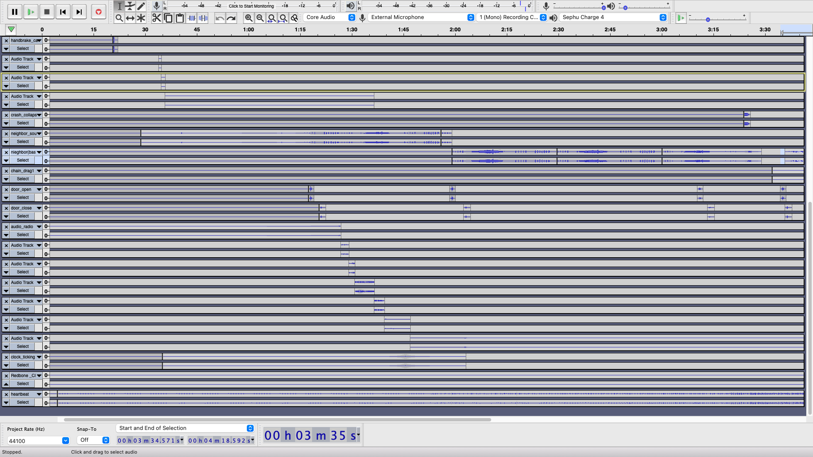
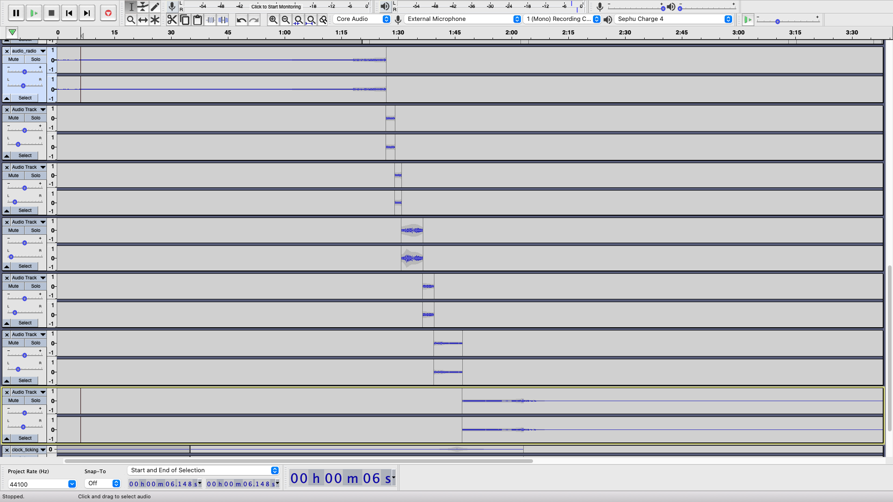

### Assignment 3: hide and seek.

#### The Concept

So, the thing is that we started with a concept for the audio before actually moving onto to the site itself. When it comes to creating an audio piece that takes you on a ‘journey,’ it’s really easy to go into the idea of literally making a journey (had this fun idea that was based off of I'm Gonna Be 500 Miles but it was, alas, too generic and very much too similar to the last assignment’s story). So, thinking about how to blow expectations out of the water (and burn the bridge behind), an idea in the form of a horror story came up. Inspiration came from Outlast and the audio performance What’s He Building? by Tom Waits.

The story goes something like this: your neighbor is sketch. Like super sketch. He’s always in his workshop in the basement of his house. You hear sounds of clanging metal and nails being pounded against wood. He never says hi and he seems like he’s hiding something. He lives alone, with no children or family. His lawn is dying, he has no dog, and some people even swear that they heard low moaning coming from inside. What’s going on inside? To tackle these questions once and for all, you decide that you’re going to see for yourself.
The original storyline was going to be longer than the end product. It was supposed to be going into the house, running into the hostage, playing a game of hide and seek (after the neighbor kills the hostage as you’re hiding in a closet nearby), then getting stuck at the top of the stairs as the door is locked.

#### The Result

What we got in the end was a website that takes you on a journey. It introduces you to the context and allows you to follow along, using visualizations to help you navigate the situation. You can change visualizations by using the arrow keys of your computer. In addition, there is the possibility to restart the adventure after it ends and you *ahem spoiler* die.

#### The Process

##### Audio: A New Hope Nightmare

So, let’s talk about Audacity for a moment.to be perfectly honest, I don’t like it anymore. I mean, editing audio is fun. It’s not as fun when you don’t know all of the shortcuts and everything needs to be done manually. Take stereo panning for example. This is how (part) of the file looks like:

Yes, as you can tell, that’s a lot of tracks. And this is actually only half of the entire audio file. The full file has over 30 different tracks, half of which are used for panning. Like I said, I made it manual because I didn’t know how to make it all happen on a single track. I did this by slowly incrementing the panning percentage with multiple tracks in order to create natural panning.

I did a lot of messing around with enveloping the audio tracks and the amplitudes of certain audio files as well. In addition, there are a lot of instances where I actually use the same sounds and repeat them over and over. The running away portion at the end was done terribly, but alas I didn’t have the strength to delete and readjust all of the timings. Which is another thing that I don’t like about Audacity–– it moves all of the files whenever you add or delete a track.
In addition to this, there were some effects that I decided to try and use. There’s the distortion that Ishika made with FCP, but I also messed around with changing tempos (the heartbeats), amplifying bass and treble (the chains at the end among others), and changing speed and pitch. 

I downloaded Logic kind of late and didn’t have time to go through the learning curve so I ended up using Audacity all the way through the project. Don’t wanna go through that again. I do believe I spent 20+ hours trying to make this. Especially since all of this was made from scratch only using a few sampled audio files and the rest I needed to record (or make using the effects; I used a creaking door to create the sound of the wooden steps, which I find pretty darn cool). For my first attempt at sound editing, I do believe that this was done quite nicely. If I had more time, I could have made it better. But that’s the case with everything.

Overall, it was fun trying to bring the story I had formulated in my head to life (at least through the ears). I’m kinda the type that scares easily so I found myself wondering why I had decided on such a dreary topic in the first place, but regardless, the fact that I had my heart pounding because of something I had made (it was not out of pride, it was because I sometimes forgot when I added a loud noise) was something pretty cool. But it was kinda frustrating using Audacity. Especially when it crashed and I lost my progress.

##### Distorted Audio: The  Emperor Visualization Strikes Back

So an issue that we faced (and continue to face even to this point) is that the audio was getting distorted and playing all funny. At first, we assumed that it was because of the size of the audio files. And so I spent a good 2-3 hours trying to figure it out. However, it doesn’t seem to be an issue with the file sizes. Right now, it works sometimes but it doesn’t others. One thing is for sure, though, and it’s that the audio itself doesn’t seem to be an issue. I tried opening the website on Firefox and, though the visualizations don’t work, the audio does. In other words, when nothing is happening on the screen, the audio plays fine, no matter how many inputs you have.

In an attempt to fix the problem, I tried to combine as many audio files together as possible. Initially, there were a total of eight audio inputs: the music, the footsteps, the heartbeat, the neighbor, the breathing, the hostage (err kidnappee), the neighbor, and everything else. But I combined as much as possible and brought it down to footsteps and breathing, the heartbeat, and everything else. I was debating whether or not to leave just the heartbeat and everything else, but at that point it’s no longer anything close to what we wanted initially (multiple audio inputs for visualizations) so I didn’t do it.

This means that what Prof Jiwon was saying about how there are too many operations going on in the program may be the case. I’m not fully sure, though, since I’ve actually tried getting rid of all of the functions and I still faced the issue on Chrome. I’m not really sure if it’s just a Chrome thing, but I can’t get p5 animations (err draw() ) to work on Firefox and Safari just won’t load it at all, so Chrome is all I have. But… oh, maybe it’s distorted when p5 runs because of the memory that’s allocated for the variables of the functions or something? I’m not really sure about how memory is allocated on a browser so I can’t really say for sure, though. Anyway, we’re trying to fix this issue but we aren’t sure how it’ll turn out. But if you want to listen to the unadulterated/undistorted version, it’s here. After all, this assignment is about audio, right?

##### Website Code: KIS (keepin’ it simple)

One thing that we didn’t have as much time to focus on was the code for the website. As such, the way we went about all of it was rather simple; we didn’t have as much time to implement everything as we wanted. This was by using a single image overlay in order to imitate fading in and fading out (this was actually rather interesting, using GIFs instead of jQuery animations). This was done by switching out the source of the image upon click.

    $('#image1').click(function(){
       count++;
       var currentimage = document.getElementById("image1");
       if(count == 1){
           currentimage.src = "data/context.gif";
       }
       else if(count == 2){
           currentimage.src = "data/img1play.png";
       }
       else if(count == 3){
           currentimage.src = "data/playButtontoHeart.gif";
       }
       else if(count == 4){
           $('#image1').animate({opacity:0});
       }
    });

It’s a bit on the hardcoded side, but we were focusing more on the p5 aspect of the project. However, this did allow us to simply create a few GIFs instead of having to code everything line by line. It’s an interesting method that I might actually use on something else.
The ending was created by setting a .onended() that linked to one of the audio files, the heartbeat, in particular. It could have just as well been the breathing, though, since both of them end at the same time. Anyway, upon the end of this, the screen fades to black and the ending animation plays. In addition, a little reset button appears. This triggers a reload() to happen, effectively restarting the adventure. Here’s the code:

    heartbeat.onended(function(){
           var currentimage = document.getElementById("image1");
           $('#image1').animate({opacity:1}).delay(1500);
           currentimage.src = "data/ending.gif";
           $('#reload').animate({opacity:1});
       });

#### Reflection

To be totally fair, we didn’t actually have a vision of what the website would look like when we started this assignment. We only had an idea of what the audio would be and that ended up being the main focus of what we were doing, alongside visualization. Perhaps it was because of this, but we didn’t add that many features to the site. And as such, you could say that we met our own expectations. Exceeded it in some places, such as the audio and the visualizations of the audio. But where we lacked was the integration of it all–– in terms of memory optimization in the web browser (which was something that I didn’t know was a thing).

If there are lessons learned, well, there are a couple.
One is that starting early is good. Most of the files were recorded beforehand, but because of a mix of midterms, projects, and assignments we weren’t able to meet up until it was rather cutting it close. It’s surprising that we did this much given all of the other things we had on our plate (why some professors choose to have midterms after break and give out projects and assignments during break is beyond me), but still.

Another lesson is that not everything goes the way that it’s planned. It’s still kind of disappointing when you consider how our grand vision was destroyed by memory and a lack of processing power. It’s a sobering thought, given that the one thing we didn’t consider in our plan but rather took for granted–– the actual browser we were using for the website ––was the very thing that became our downfall.

But I guess in the end we did our best and that’s what matters. Maybe the website didn’t turn out as pretty as we wanted it to, nor did the audio with multiple inputs play the way that it should have, but we did our best in each task that we were assigned and that’s what counts. The website isn’t terrible, but it isn’t the best out there, either. It was a mix of experimentation with p5, Audacity, multiple sound sources, and audio visualization that ended up being just about what you would expect from a first attempt at something completely different. A little better, actually. 

Anyway, the point is that though we might want to make something better, we don’t really have all the skills. This is a return to Assignment 1 (*horizontal scrolling intensifies*); an attempt at something new. It takes time and now we’re better prepared, equipped with knowledge and skills we didn’t have before this assignment. Moving forward and all that ;)
And with that, onto the next nightmare adventure!
